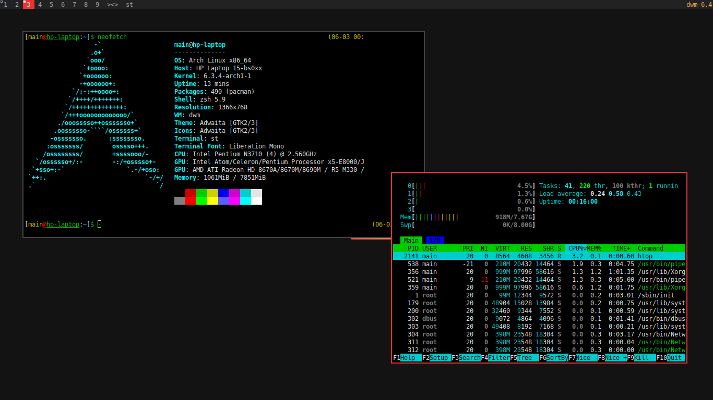

## Notes
- It is assumed that the user name is `main` and OS is Arch Linux.


## Setting up
Using [stow](https://www.gnu.org/software/stow/manual/stow.html):
- Install **user** package: `stow -v -R -d user -t ~/ package-name`
- Install **system** package: `sudo stow -v -R -d system -t / package-name`


## Applications
- **Shell**: [zsh](https://wiki.archlinux.org/title/Zsh)
- **Window manager**: [dwm](https://github.com/xfnty/dwm)
- **Compositor**: [picom](https://wiki.archlinux.org/title/Picom)
- **Terminal**: [st](https://st.suckless.org/)
- **Hotkey manager**: [sxhkd](https://wiki.archlinux.org/title/Sxhkd)
- **Screenshot utility**: [scrot](https://archlinux.org/packages/extra/x86_64/scrot/)


## Other packages
For Arch linux:
```
sudo pacman -S pactl pamixer xorg-xset light feh mpv waterfox
```
