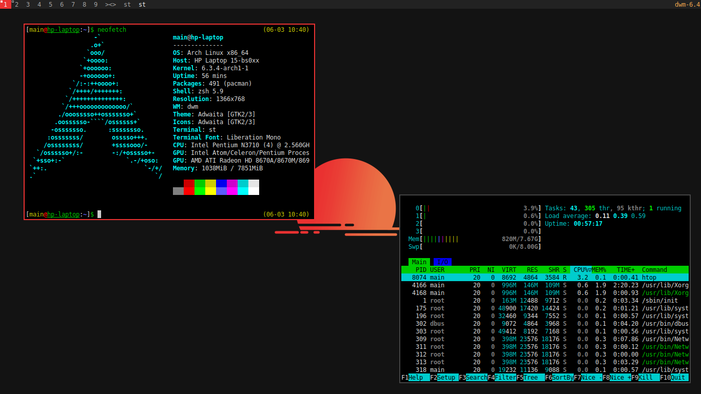

## Notes
- It is assumed that the user name is `main` and OS is Arch Linux.


## Setting up
Using [stow](https://www.gnu.org/software/stow/manual/stow.html):
- Install **user** package: `stow -v -R -d user -t ~/ package-name`
- Install **system** package: `sudo stow -v -R -d system -t / package-name`


## Applications
- **Terminal**: [zsh](https://wiki.archlinux.org/title/Zsh)
- **Browser**: [waterfox](https://www.waterfox.net/)
- **Backlight utility**: [light](https://archlinux.org/packages/extra/x86_64/light/)
- **Window manager**: [dwm](https://github.com/xfnty/dwm)
- **Background utility**: [feh](https://wiki.archlinux.org/title/Feh)
- **Hotkey manager**: [sxhkd](https://wiki.archlinux.org/title/Sxhkd)
- **Media player**: [mpv](https://mpv.io/)
- **Screenshot utility**: [scrot](https://archlinux.org/packages/extra/x86_64/scrot/)


## Other packages
For Arch linux:
```
pactl pamixer
```
